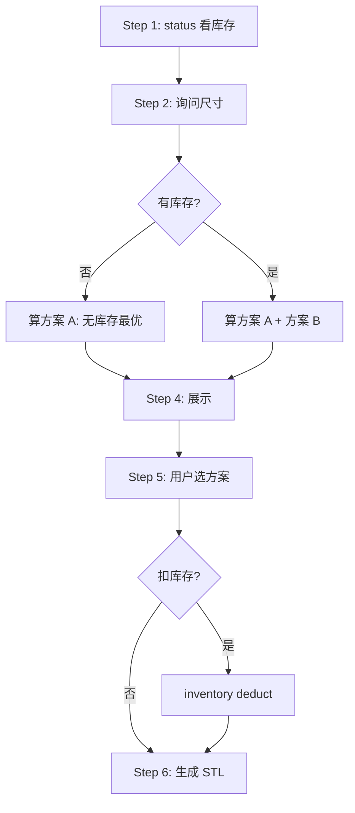

# openGrid 抽屉铺满

根据抽屉尺寸计算最优瓦片分割方案，并可生成 STL 文件用于 3D 打印。

## 核心原则

**Agent 负责用户交互，脚本负责计算和生成。**

所有命令在仓库根目录执行（`opengrid_config.yaml` 和 `inventory.json` 所在的目录），不需要 `-c` / `-i` 指针参数。

## Agent 工作流



### Step 1: 看现状

```bash
uv run scripts/opengrid.py status
```

输出当前打印机配置、输出目录和库存。

### Step 2: 询问需求

询问抽屉尺寸和份数，支持格式：

- `265x365:2` = 265×365mm，2 份
- `265x365` = 265×365mm，1 份
- `265 365 2` = 空格分隔

**抽屉命名**：用户给多个尺寸时按首次出现顺序命名（抽屉 A、抽屉 B…），后续统一用名称展示。

### Step 3: 计算方案

**自动双方案**：库存非空时同时算两种：

1. **方案 A**：不考虑库存（追求最优切割）
2. **方案 B**：使用库存（追求最少打印）

库存为空时只算方案 A。

```bash
# 方案 A：不使用库存
uv run scripts/opengrid.py split 265x365:2 325x365:2 --json > scheme_a.json

# 方案 B：使用库存
uv run scripts/opengrid.py -i inventory.json split 265x365:2 325x365:2 --json > scheme_b.json
```

### Step 4: 展示方案

简洁终端展示：

```
=== 抽屉A: 265x365mm x2 ===

[A] 方案A: 2次打印, ~25分钟, ~95g
[B] 方案B: 1次打印, ~12分钟, ~45g (节省52%)

瓦片对比:
    7x5: A=x4(打印), B=x2(库)+x2(打印)
    3x5: A=x4(打印), B=x4(打印)

[H] 生成 HTML 对比页面
[Q] 退出
```

需要 HTML 对比时：

```bash
uv run scripts/opengrid.py compare scheme_a.json scheme_b.json -o comparison.html
```

### Step 5: 扣减库存（可选）

用户选定方案后询问是否扣库存：

```bash
uv run scripts/opengrid.py inventory deduct 8x8:2 --reason "完成 325x460 项目施工"
```

### Step 6: 生成 STL

```bash
uv run scripts/opengrid.py slicer generate 7x5x2
uv run scripts/opengrid.py slicer generate 3x5x2
```

输出到 `opengrid_config.yaml` 中 `output.stl_dir` 指定的目录。

## 库存管理

**严格禁止直接编辑 `inventory.json`。** 所有修改必须走 CLI，并提供原因。

```bash
# 查看
uv run scripts/opengrid.py inventory list

# 添加（格式：宽x高:数量）
uv run scripts/opengrid.py inventory add 8x8:5 6x7:3 --reason "入库：购买新材料"

# 扣减
uv run scripts/opengrid.py inventory deduct 8x8:2 --reason "完成项目施工"

# 撤销上次操作
uv run scripts/opengrid.py inventory undo
```

每次操作自动记录到日志。

## 配置文件

仓库根目录的 `opengrid_config.yaml` 是唯一配置文件。

```yaml
initialized: true
printer:
  model: p1p              # a1_mini, a1, p1p, p1s, x1c, x1e, h2d
output:
  stl_dir: ~/3D打印/opengrid/
opengrid:
  tile_type: Full         # Full, Lite, Heavy
  stacking_method: Ironing
  interface_separation: 0.2
  tile_size: 28
```

打印机预设和瓦片参数见 [references/CONFIG.md](references/CONFIG.md)。

## 参考文档

- [references/CONFIG.md](references/CONFIG.md) - 配置详解
- [references/ALGORITHM.md](references/ALGORITHM.md) - 算法规则
- [references/SLICER.md](references/SLICER.md) - Slicer 集成
- [references/TROUBLESHOOTING.md](references/TROUBLESHOOTING.md) - 故障排除
