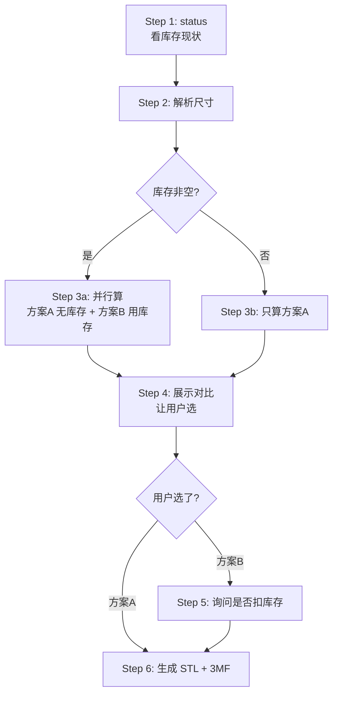

# openGrid 抽屉铺满

根据抽屉物理尺寸（mm），算出用哪几块 openGrid 瓦片拼起来最优，并可生成 STL 文件交给切片软件打印。

## 核心原则

**Agent 负责用户交互和展示，脚本只做计算和输出结构化数据。**

脚本不会问用户问题（没有 `input()`），所有"是否打印 / 是否扣库存 / 看哪个方案"都由 Agent 跟用户对话决定，再调用相应命令。

**所有命令在仓库根目录执行**（即 `opengrid_config.yaml` 所在目录）。不需要也不该传 `-c` / `-i` 指针——默认从当前目录的配置读取。

## Agent 工作流



### Step 1: 看现状

```bash
# 给人看：
uv run scripts/opengrid.py status

# Agent 需要结构化字段（决定要不要算两个方案）就用 JSON：
uv run scripts/opengrid.py status --json
```

JSON 输出含 `printer / output / opengrid / inventory.{items, total_types, total_count}`。
`inventory.total_count == 0` 时跳过方案 B。

### Step 2: 解析尺寸

接受多种格式：

| 用户输入 | 含义 |
|---------|------|
| `225x255` | 单只 225×255mm 抽屉 |
| `225x255:2` | 两只 225×255mm 抽屉 |
| `225×255` | `×` 是 Unicode U+00D7，等同 `x` |
| `225 255` | 空格分隔也行 |
| `225x255:2 325x460` | 多种尺寸混合批量 |

多个尺寸直接全部作为位置参数传给 `split`，脚本会**联合规划**（瓦片跨抽屉合并打印、库存全局分配）。
无法识别的词或太小无法分割的抽屉会直接报错退出（exit 1），不会静默丢掉。

**多种尺寸时脚本按出现顺序命名**：`drawers[].name` 就是 抽屉A、抽屉B、抽屉C…… 后续展示统一用这个名字，避免 `265x365` 这种数字串反复出现增加阅读负担。

### Step 3: 算方案

**关键**：如果 `opengrid_config.yaml` 配了 `inventory_path`（默认情况），`split` 默认会用库存。要算"不考虑库存"的最优方案 A，**必须**加 `--no-inventory`，否则两个方案算出来是同一个。

```bash
# 方案 A：不用库存（追求最优切割、最少种类）
uv run scripts/opengrid.py split 225x255:2 325x460 --no-inventory --json > scheme_a.json

# 方案 B：用库存（追求最少打印、节省耗材）
uv run scripts/opengrid.py split 225x255:2 325x460 --json > scheme_b.json
```

库存为空时只算方案 A 即可（B 会跟 A 完全一样，对比没意义）。

JSON 结构随抽屉数不同（用有没有 `drawers` 字段区分）：

**单只抽屉**：`dimensions / grid / tiles / prints / stats / cost / inventory_usage / slicer_commands`

- `stats.total_time_min` / `stats.filament_main_g` —— 给用户看的总览
- `cost.total_cost` / `cost.plate_count` —— 时间/盘数细节

**多只抽屉**：`drawers / tiles / stats / inventory_usage / slicer_commands`

- `drawers[]` —— 每只抽屉的 `name`（抽屉A…）、尺寸、份数、`scheme` 分割、每份 `tiles`、`inventory`（本抽屉分到的库存 / 需打印，已乘份数）
- `tiles[]` —— 跨抽屉合并后每种瓦片：`count` 总块数、`from_inventory`、`to_print`、`prints` 盘数、`stack_layers` 每盘层数、`sources` 来自哪些抽屉
- `stats.total_time_min` / `stats.total_filament_g` / `stats.total_prints` —— 总览

**两种都有**：

- `inventory_usage.from_inventory` / `need_print` / `total_from_inventory` / `total_need_print` —— 库存覆盖明细，用来给方案 B 算"节省了多少"；Step 5 扣库存就按 `from_inventory` 扣
- **`slicer_commands`** —— 一个数组，每条是可直接 exec 的 `slicer 3mf WxHxS` 命令。Step 6 直接用，**不要再人脑算 stack 层数**。

库存 key 与方向无关，统一写成小边在前（`6x7`，不是 `7x6`）；CLI 两种写法都接受。

### Step 4: 展示并让用户选

脚本只输出结构化数据，**Agent 负责把它们拼成给用户看的菜单**。建议格式：

```
=== 抽屉A: 225x255mm × 2 ===

[A] 方案 A: 2 次打印, ~25 min, ~95g  （不用库存，2 种独特尺寸）
[B] 方案 B: 1 次打印, ~12 min, ~45g  （用库存，节省 52%）

瓦片对比：
  7×5: A=打印 ×4, B=库存 ×2 + 打印 ×2
  3×5: A=打印 ×4, B=打印 ×4

[H] 生成 HTML 网页对比页面
[Q] 退出
```

用户要看可视化对比时，用 `compare` 子命令（会自动在浏览器打开，调试或远程会话加 `--no-open`；
已存在的输出文件要加 `-f` 覆盖）。单抽屉和多抽屉的 JSON 都支持，但两个文件必须用同一组尺寸算出来：

```bash
uv run scripts/opengrid.py compare scheme_a.json scheme_b.json -o comparison.html
```

### Step 5: 扣减库存（选 B 时询问）

用户选了方案 B 后，**先问一句**「是否扣减库存」再动手——有时候用户只是看看，不立刻施工。

```bash
uv run scripts/opengrid.py inventory deduct 7x5:2 --reason "施工 225x255 抽屉 A"
```

`--reason` 是必传的，会写进 `inventory.json` 的 `log` 数组（可审计）。如果扣错了：

```bash
uv run scripts/opengrid.py inventory undo
```

### Step 6: 生成 STL + 3MF

**直接遍历 Step 3 JSON 里的 `slicer_commands` 数组逐条 exec**，Step 3 已经把"哪几个尺寸要打几层"算好了。
每条 `slicer 3mf WxHxS` 做两件事：用 OpenSCAD 生成 STL，再打包成带打印预设的 BambuStudio 项目 3MF（未切片）。

> 数组顺序来自 split 算法对 `need_print` 字典的迭代顺序，**不保证语义**（既不是面积降序也不是时间降序）。Agent 不要假设顺序代表打印优先级。

```bash
# 形如：
# ["slicer 3mf 3x8x2", "slicer 3mf 6x6x4"]
# Agent 把每条按字面 exec 就行
uv run scripts/opengrid.py slicer 3mf 3x8x2
uv run scripts/opengrid.py slicer 3mf 6x6x4
```

边界情况：

- `slicer_commands == []` —— 库存全覆盖（或抽屉需打印数为 0），告诉用户"不需要打印新瓦片，可直接施工"，**跳过 Step 6**。
- 用户问 WxHxS 的含义：W/H 是瓦片格子数，S 是垂直堆叠的 Tile 层数（一次打印盘多产出）。**不要让用户/Agent 自己从 `need_print` 计算 S** —— `slicer_commands` 已经按 Z 高度限制拆好了。
- stderr 出现 `警告:` —— 通常是瓦片太大、盘面放不下擦料塔，要转告用户在 BambuStudio 里手动挪一下擦料塔。
- 只要 STL 不要 3MF：把命令里的 `3mf` 换成 `generate`。
- 螺丝孔默认读 `opengrid.screw_mounting`（当前 `Corners`，四角各一个 M4 沉头孔）；单次要改就在命令后加
  `--screws None|Corners|Everywhere`。带孔的文件名有后缀，如 `openGrid_Full_4x10x2_screwCorners.3mf`。

输出到 `opengrid_config.yaml` 中 `output.stl_dir` 配置的目录，文件名形如
`openGrid_Full_7x5x2.stl` / `openGrid_Full_7x5x2.3mf`。已存在时跳过；`--force` 两者都强制重生。
需要看实际 OpenSCAD 命令（调试用）加 `-v` / `--verbose`。

**3MF 里的打印配方**（模板 `opengrid/stl/templates/h2d_pla_support.project_settings.config`，
取自 2026-02-20 实际打印成功的项目）：H2D 0.4 + `Opengrid堆叠打印` 工艺，耗材 1 = Bambu PLA Basic
（本体 + 普通支撑），耗材 2 = Bambu Support For PLA/PETG（**支撑接触面**，跟 PLA 不粘，堆叠层能掰开），
开擦料塔；瓦片放双喷嘴公共区域左下角，擦料塔自动放到旁边空位。用户在 BambuStudio 打开后
核对 AMS 槽位 → 切片 → 打印。模板只适配 H2D，其他机型只出 STL 并警告。

依赖 OpenSCAD CLI + QuackWorks submodule + BOSL2，缺失时会报清晰错误并提示
`/opengrid-drawer-filler-setup` skill。

> **限制**：3MF 是**未切片**的项目文件，没有 G-code，不能直接发给打印机。`slicer slice` / `slicer open`
> 仍是 `[未实现]`（切片器 CLI 需要图形界面，无头环境跑不了）。

## 库存管理

**严格禁止直接编辑 `inventory.json`**——格式被 schema 校验，手改容易破坏 `log` 数组的可追溯性。所有修改走 CLI：

```bash
uv run scripts/opengrid.py inventory init                                # 首次创建空库存
uv run scripts/opengrid.py inventory list                                # 查看（人话）
uv run scripts/opengrid.py inventory list --json                         # 查看（Agent 解析）
uv run scripts/opengrid.py inventory add 8x8:5 6x7:3 --reason "原因"     # 加
uv run scripts/opengrid.py inventory deduct 8x8:2 --reason "原因"        # 减
uv run scripts/opengrid.py inventory undo                                # 撤销上一步
```

`--reason` 必传，每次操作自动追加到日志。

## 配置

仓库根 `opengrid_config.yaml` 是唯一配置文件。修改后立即生效（脚本每次启动重新读）。

```yaml
initialized: true
printer:
  model: p1p              # a1_mini, a1, p1p, p1s, x1c, x1e, h2d
output:
  stl_dir: ~/3D打印/opengrid/
inventory_path: ./inventory.json
opengrid:
  tile_type: Full         # Full / Lite / Heavy
  stacking_method: Ironing
  interface_separation: 0.2
  tile_size: 28
  screw_mounting: Corners # 螺丝孔 None / Corners（四角）/ Everywhere（每个格点），M4 沉头
```

打印机预设和瓦片参数详见 [references/CONFIG.md](references/CONFIG.md)。

## 参考文档

按需查阅，不要预读：

| 文件 | 什么时候看 |
|------|----------|
| [references/CONFIG.md](references/CONFIG.md) | 用户问打印机型号、瓦片类型、自定义床位 |
| [references/ALGORITHM.md](references/ALGORITHM.md) | 用户问"为什么算成这样"、调算法参数 |
| [references/SLICER.md](references/SLICER.md) | 切片器集成限制与替代方案 |
| [references/TROUBLESHOOTING.md](references/TROUBLESHOOTING.md) | 命令报错、配置/库存读不到 |
