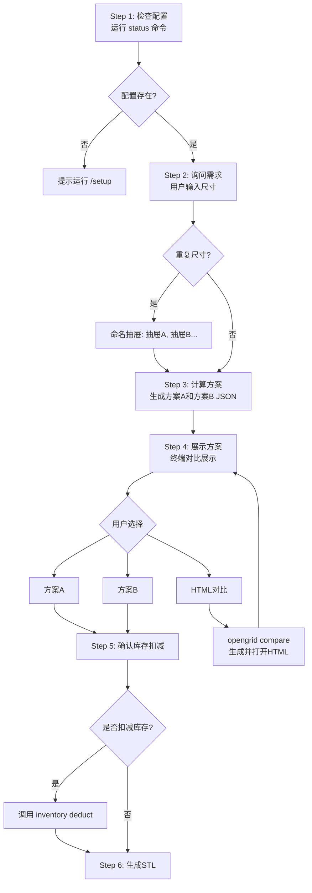

# opengrid-drawer-filler 工作流优化设计

## 概述

优化 opengrid-drawer-filler skill 的工作流程，解决发现的问题。

## 问题列表

| # | 问题 | 结论 |
|---|------|------|
| 1 | 库存未自动扣减 | Step 5 询问用户，确认后扣减 |
| 2 | 方案 A/B 选择逻辑不清晰 | 方案 A/B 分开展示，中文简洁格式 |
| 3 | present 命令未集成 | 新增 `opengrid compare` 命令 |
| 4 | 无"上一步"功能 | Agent 记忆，支持返回 |
| 5 | JSON 需要重新生成 | Step 3 同时生成并保存 |
| 6 | 跳过 status 检查 | 强制检查 |
| 7 | 抽屉尺寸未验证 | 未讨论 |
| 8 | 批量输入体验 | 抽屉A、B、C... 命名 |

## 流程图



## 详细设计

### Step 1: 检查配置

- 强制要求先运行 `opengrid status`
- 检查配置文件存在

### Step 2: 询问需求 + 命名

- 用户输入尺寸，如 `265x365 325x460`
- 解析尺寸，按首次出现顺序命名：
  - 抽屉A = 265x365
  - 抽屉B = 325x460
- 后续统一使用抽屉A、抽屉B

### Step 3: 计算方案

- 同时计算方案A（无库存）和方案B（有库存）
- 同时生成并保存两个 JSON 文件供后续使用

### Step 4: 展示方案

终端简洁格式：

```
=== 抽屉A: 265x365mm x2 ===

[A] 方案A: 2次打印, ~25分钟, ~95g
[B] 方案B: 1次打印, ~12分钟, ~45g (节省52%)

瓦片对比:
    7x5: A=x4(打印), B=x2(库)+x2(打印)
    3x5: A=x4(打印), B=x4(打印)

[H] 生成HTML对比页面
[Q] 退出
```

### Step 5: 库存扣减

- 用户选择方案后询问：
  - `[Y] 确认扣减库存并生成 STL`
  - `[N] 只生成 STL，不扣减库存`

### 新增命令: opengrid compare

```bash
# 对比两个 JSON 并打开 HTML
uv run scripts/opengrid.py compare scheme_a.json scheme_b.json -o comparison.html
```

功能：
1. 读取两个 JSON 文件
2. 调用 present 生成 HTML
3. 用系统命令打开 HTML

## 待实现

- [ ] 修改 SKILL.md 流程描述
- [ ] 新增 compare 子命令
- [ ] 实现抽屉命名逻辑
- [ ] 实现终端展示格式化
- [ ] 实现库存扣减交互
