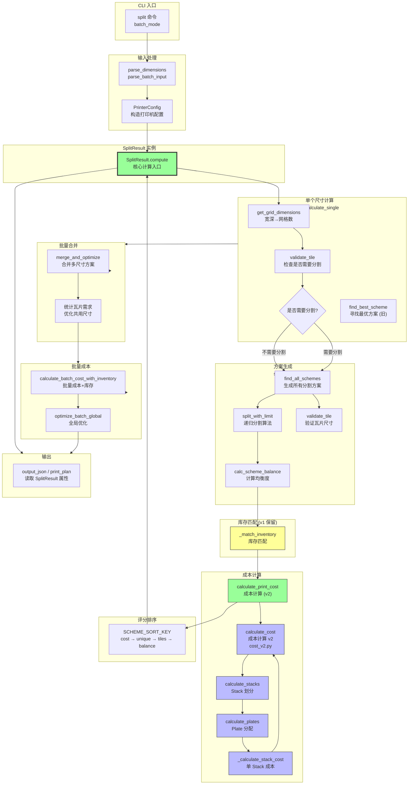

```mermaid
flowchart TB
    subgraph CLI["CLI 入口"]
        A["split 命令<br/>batch_mode"]
    end

    subgraph Input["输入处理"]
        B["parse_dimensions<br/>parse_batch_input"]
        B1["PrinterConfig<br/>构造打印机配置"]
    end

    subgraph SplitResult["SplitResult 实例<br/>一次计算，到处读取"]
        SR["SplitResult.compute<br/>核心计算入口"]
    end

    subgraph Single["单个尺寸计算<br/>calculate_single"]
        C["get_grid_dimensions<br/>宽深→网格数"]
        D["validate_tile<br/>检查是否需要分割"]
        E{"是否需要分割?"}
        F["find_best_scheme<br/>寻找最优方案 (旧)"]
    end

    subgraph SchemeGen["方案生成<br/>scheme.py"]
        G["find_all_schemes<br/>生成所有分割方案"]
        H["split_with_limit<br/>递归分割算法"]
        I["validate_tile<br/>验证瓦片尺寸"]
        J["calc_scheme_balance<br/>计算均衡度"]
    end

    subgraph Cost["成本计算"]
        K["calculate_print_cost<br/>成本计算 (v2)"]
        L["calculate_cost<br/>成本计算 v2<br/>cost_v2.py"]
        M["calculate_stacks<br/>Stack 划分"]
        N["calculate_plates<br/>Plate 分配"]
        O["_calculate_stack_cost<br/>单 Stack 成本"]
    end

    subgraph Inventory["库存匹配 (v1 保留)"]
        IM["_match_inventory<br/>库存匹配"]
    end

    subgraph Scoring["评分排序"]
        P["SCHEME_SORT_KEY<br/>cost → unique → tiles → balance"]
    end

    subgraph Merge["批量合并<br/>merge_and_optimize"]
        Q["merge_and_optimize<br/>合并多尺寸方案"]
        R["统计瓦片需求<br/>优化共用尺寸"]
    end

    subgraph Batch["批量成本"]
        S["calculate_batch_cost_with_inventory<br/>批量成本+库存"]
        T["optimize_batch_global<br/>全局优化"]
    end

    subgraph Output["输出"]
        U["output_json / print_plan<br/>读取 SplitResult 属性"]
    end

    A --> B
    B --> B1
    B1 --> SR
    SR --> C
    C --> D
    D --> E
    E -->|"不需要分割"| G
    E -->|"需要分割"| G
    G --> H
    G --> I
    H --> J
    J --> IM
    IM --> K
    K --> L
    K --> P
    P --> SR
    SR --> Output

    Single --> Merge
    Merge --> Q
    Q --> R
    R --> Batch

    L --> M
    M --> N
    N --> O
    O --> L

    Batch --> S
    S --> T
    T --> Output

    style SR fill:#9f9,stroke:#333,stroke-width:3px
    style K fill:#9f9,stroke:#333
    style L fill:#bbf,stroke:#333
    style M fill:#bbf,stroke:#333
    style N fill:#bbf,stroke:#333
    style O fill:#bbf,stroke:#333
    style IM fill:#ff9,stroke:#333
```
